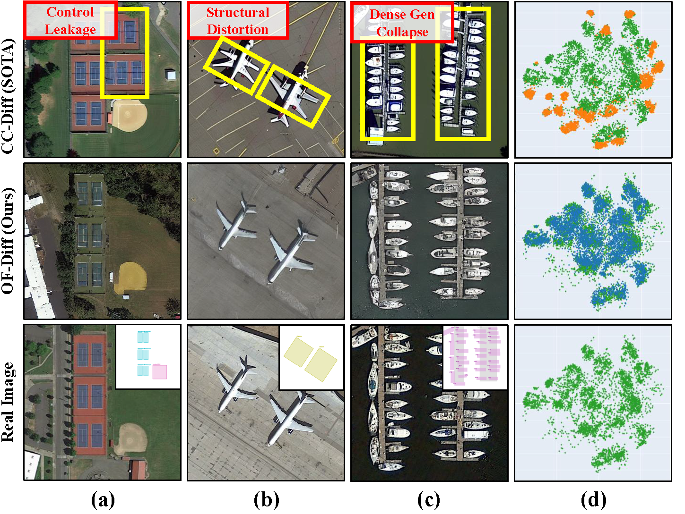
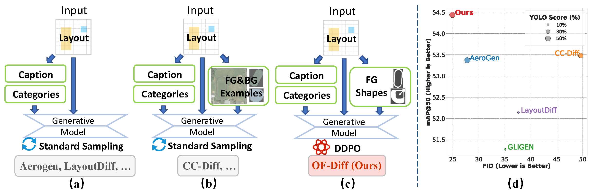
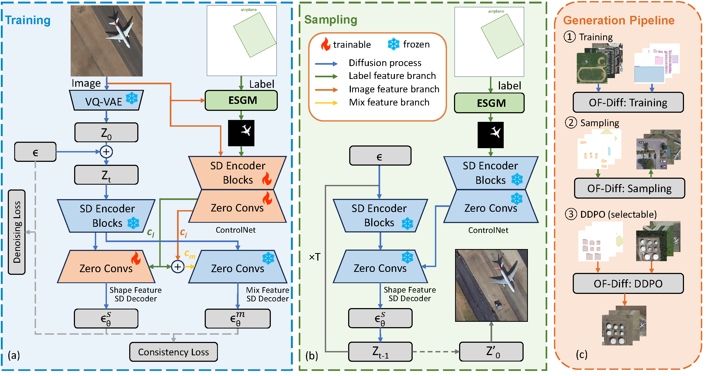
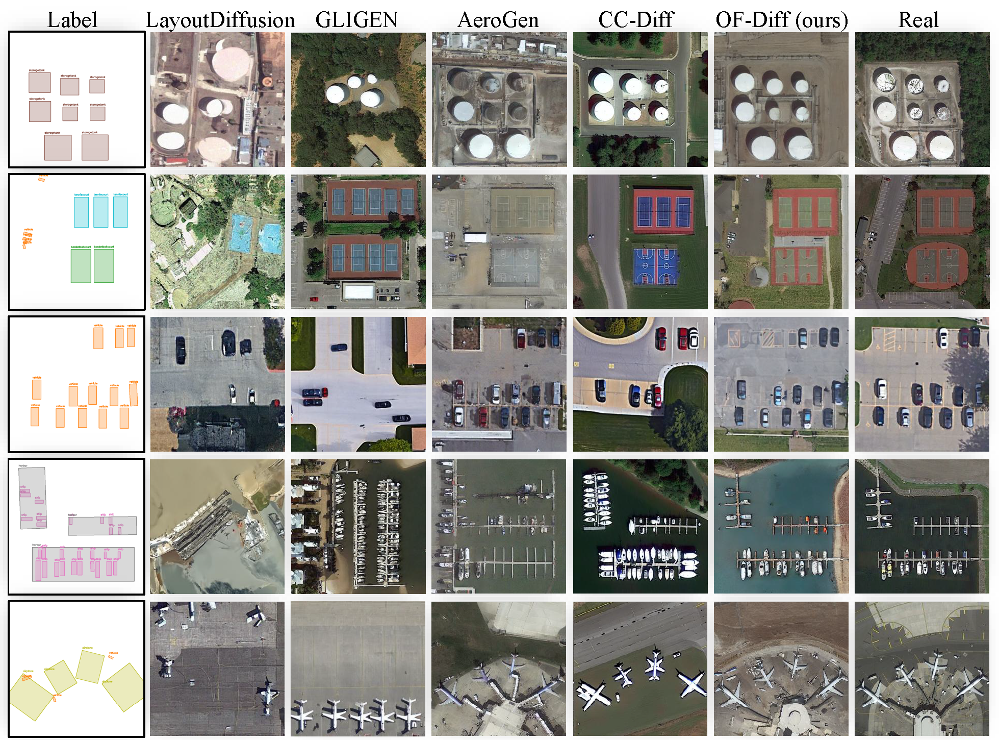
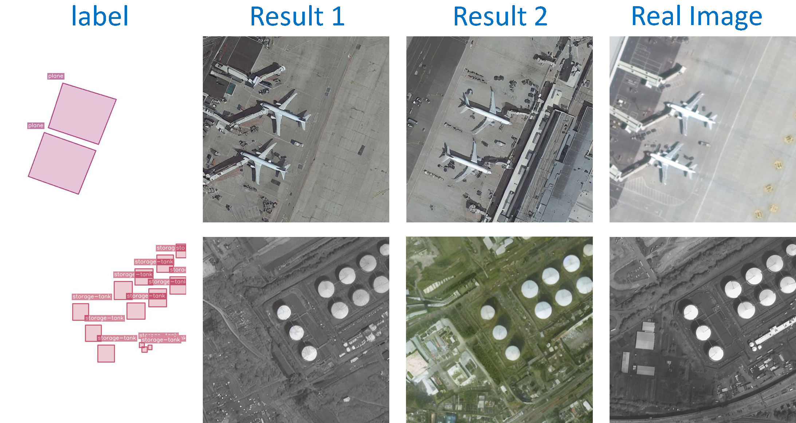
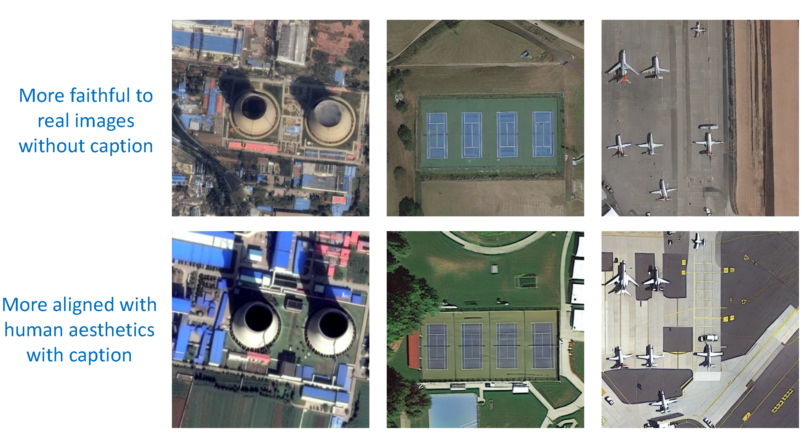
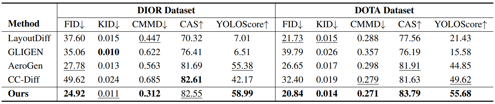
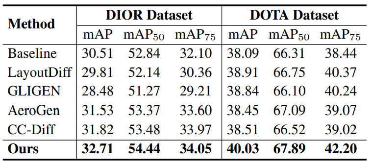
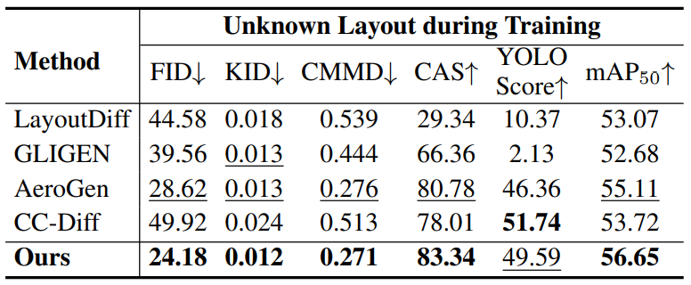

<div align="center">
<h1>OF-Diff: Object Fidelity Diffusion for Remote Sensing Image Generation</h1>
</div>
<a href='https://arxiv.org/abs/2508.10801'></a>  <a href=#citation></a> 

- We summarize common failure modes in the generation of remote sensing images, including control leakage, structural distortion, dense generation collapse, and feature-level mismatch. In these four aspects, OF-Diff outperforms the current state-of-the-art methods.

<p align="center">
  
</p>

## Abstract
<div style="text-align:justify">
High-precision controllable remote sensing image generation is both meaningful and challenging. Existing diffusion models often produce low-fidelity images due to their inability to adequately capture morphological details, which may affect the robustness and reliability of object detection models. To enhance the accuracy and fidelity of generated objects in remote sensing, this paper proposes Object Fidelity Diffusion (OF-Diff), which effectively improves the fidelity of generated objects. Specifically, we are the first to extract the prior shapes of objects based on the layout for diffusion models in remote sensing. Then, we introduce a dual-branch diffusion model with diffusion consistency loss, which can generate high-fidelity remote sensing images without providing real images during the sampling phase. Furthermore, we introduce DDPO to fine-tune the diffusion process, making the generated remote sensing images more diverse and semantically consistent. Comprehensive experiments demonstrate that OF-Diff outperforms state-of-the-art methods in the remote sensing across key quality metrics. Notably, the performance of several polymorphic and small object classes shows significant improvement. For instance, the mAP increases by 8.3%, 7.7%, and 4.0% for airplanes, ships, and vehicles, respectively.
</div>


## Overview
* **Comparison of OF-Diff with Mainstream Methods.**
<p align="center">
  
</p>


* **An Overview of OF-Diff and Pipeline.**
<p align="center">
  
</p>

## Main Results

* **Comparison of the Generation Results of OF-Diff with Other Methods.**

<p align="center">
  
</p>


* **Diversity Results and Style Preference Results**

<div align="center">
    <table>
        <tr>
            <td align="center">
                
            </td>
            <td align="center">
                
            </td>
        </tr>
    </table>
</div>

* **Quantitative Comparison with Other Methods on DIOR and DOTA.**

<p align="center">
  
</p>


* **Trainability Comparison Results, and the Results on Unknown Layout Dataset during Training **

<div align="center">
    <table>
        <tr>
            <td align="center">
                
            </td>
            <td align="center">
                
            </td>
        </tr>
    </table>
</div>


## Getting Started
### 1. Conda environment setup

```bash
conda env create -f environment.yaml
conda activate aerogen
```

### 2. Data Preparation

**2.1 Dataset and structure**

You need to download the dataset. Taking [DIOR](https://pan.baidu.com/s/1iLKT0JQoKXEJTGNxt5lSMg#list/path=%2F) as an example, the dataset needs to be processed (see the [data_process.md](./tools/data_preparation.md)) to form the following format.

```
DIOR-R-train
├── images
│   ├── 00001.jpg
|   ├── ...
|   ├── 05862.jpg
├── labels
|   ├── 00001.jpg
|   ├── ...
|   ├── 05862.jpg
├── prompt.json
```
**2.2 weights**

Initialize the ControlNet model using the pretrained UNet encoder weights obtained from Stable Diffusion, and subsequently merge these weights with the Stable Diffusion model weights, saving the result as ./model/control_sd15_ini.ckpt.

```bash
python ./tools/add_control.py
```


### 3. Training

```bash
python train.py
```
### 4. Sampling

```bash
python merge_weights.py ./path/to/checkpoints
python inference.py
```

## TODOs

- [x] Release the paper on arXiv.
- [x] Release the initial code.
- [ ] Release the complete code.
- [ ] Release synthetic images by OF-Diff.

## Contact

If you have any questions about this paper or code, feel free to email me at [ye.ziqi19@foxmail.com](mailto:ye.ziqi19@foxmail.com). This ensures I can promptly notice and respond!

## Acknowledgements

Our work is based on [Stable Diffusion](https://github.com/Stability-AI/StableDiffusion), [ControlNet](https://github.com/lllyasviel/ControlNet), [RemoteSAM](https://github.com/1e12Leon/RemoteSAM), we appreciate their outstanding contributions. In addition, we are also extremely grateful to [AeroGen](https://github.com/Sonettoo/AeroGen) and [CC-Diff](https://github.com/AZZMM/CC-Diff) for their outstanding contributions in the field of remote sensing image generation. It is their excellent experiments that have promoted the development of this field.

## Citation

```
@misc{ye2025objectfidelitydiffusionremote,
      title={Object Fidelity Diffusion for Remote Sensing Image Generation}, 
      author={Ziqi Ye and Shuran Ma and Jie Yang and Xiaoyi Yang and Ziyang Gong and Xue Yang and Haipeng Wang},
      year={2025},
      eprint={2508.10801},
      archivePrefix={arXiv},
      primaryClass={cs.CV},
      url={https://arxiv.org/abs/2508.10801}, 
}
```